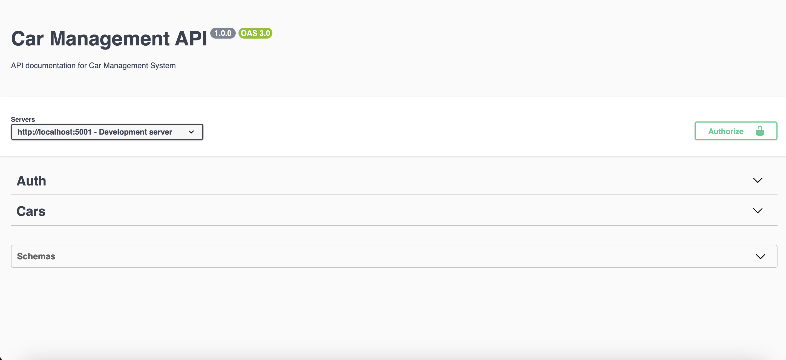
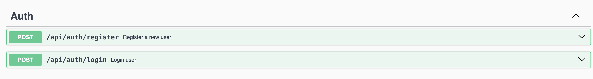
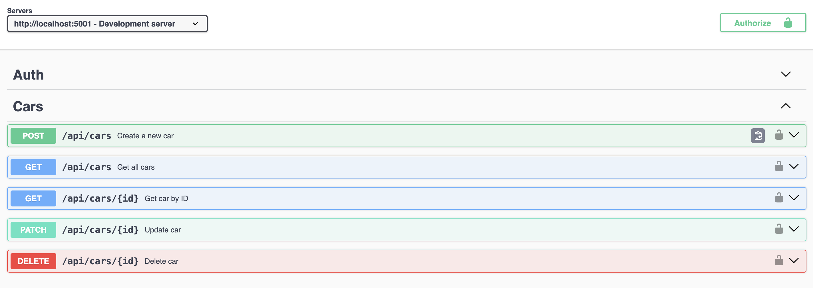
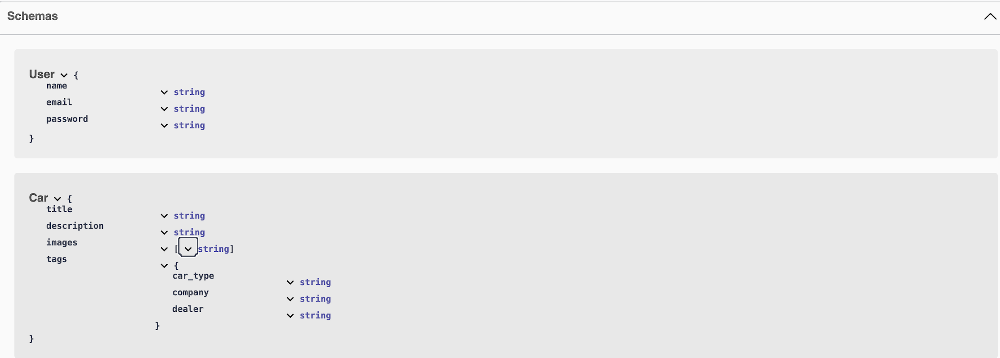

# Car Management API

A comprehensive REST API for managing car listings with authentication, image uploads, and tagging functionality.

## Table of Contents
- [Installation](#installation)
- [Environment Configuration](#environment-configuration)
- [Getting Started](#getting-started)
- [API Documentation](#api-documentation)
- [API Endpoints](#api-endpoints)
- [Screenshots](#screenshots)
- [Contributing](#contributing)
- [License](#license)

## Installation

```bash
npm install
```

## Environment Configuration

Create a `.env` file in the root directory with the following configurations:

```env
PORT=PORT 
MONGO_URI=mongodb+srv://<username>:<password>@<cluster>/<database>?retryWrites=true&w=majority
JWT_SECRET=<your_secret_key>
```

## Getting Started

Start the server:

```bash
npm start
```

Access Swagger API documentation at `http://localhost:<PORT>/api/docs`

## API Documentation

This project uses Swagger for API documentation. Access the interactive API documentation at:

```
http://localhost:5000/api/docs
```

## API Endpoints

### Authentication

#### Register
- **Method**: POST
- **Endpoint**: `/api/auth/register`

#### Login
- **Method**: POST
- **Endpoint**: `/api/auth/login`

### Car Management

#### Create Car
- **Method**: POST
- **Endpoint**: `/api/cars`
- **Example**:
```bash
curl -X POST http://localhost:5000/api/cars \
  -H "Authorization: Bearer <JWT_TOKEN>" \
  -F "title=Car Model X" \
  -F "description=A high-end sports car" \
  -F "tags[car_type]=Sports" \
  -F "tags[company]=CarCo" \
  -F "tags[dealer]=XYZ Motors" \
  -F "images=@path/to/image.jpg"
```

#### Get All Cars
- **Method**: GET
- **Endpoint**: `/api/cars?search=keyword`
- **Example**:
```bash
curl -X GET http://localhost:5000/api/cars?search=Sports \
  -H "Authorization: Bearer <JWT_TOKEN>"
```

#### Get a Car by ID
- **Method**: GET
- **Endpoint**: `/api/cars/:id`
- **Example**:
```bash
curl -X GET http://localhost:5000/api/cars/<car_id> \
  -H "Authorization: Bearer <JWT_TOKEN>"
```

#### Update a Car
- **Method**: PATCH
- **Endpoint**: `/api/cars/:id`
- **Example**:
```bash
curl -X PATCH http://localhost:5000/api/cars/<car_id> \
  -H "Authorization: Bearer <JWT_TOKEN>" \
  -F "title=Updated Model" \
  -F "tags[car_type]=Luxury"
```

#### Delete a Car
- **Method**: DELETE
- **Endpoint**: `/api/cars/:id`
- **Example**:
```bash
curl -X DELETE http://localhost:5000/api/cars/<car_id> \
  -H "Authorization: Bearer <JWT_TOKEN>"
```

## Screenshots

## Swagger UI

### Swagger UI Example


### Swagger Auth


### Swagger Cars


### Swagger Schema



## Contributing

We welcome contributions to enhance the functionality. Please follow these steps:

1. Fork the repository
2. Create a new branch
3. Commit your changes
4. Submit a pull request

## License

This project is licensed under the MIT License.